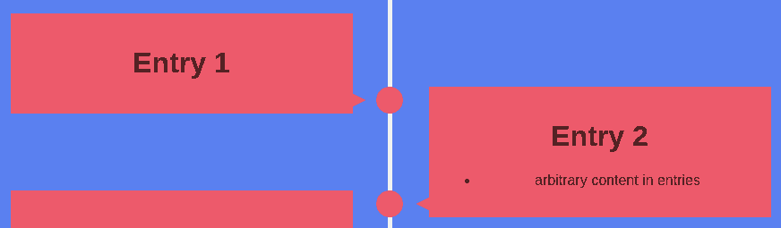

**Deprecated. Consider switching to [react-vertical-timeline-component](https://www.npmjs.com/package/react-vertical-timeline-component) or using [vanilla CSS](https://codepen.io/savalazic/pen/QKwERN/).**

[](https://travis-ci.org/ftes/react-dual-timeline)
[](https://www.npmjs.com/package/react-dual-timeline)

# React Timeline
A react component for animated timelines.



Based on the [CSS and Javascript template](https://webdesign.tutsplus.com/tutorials/building-a-vertical-timeline-with-css-and-a-touch-of-javascript--cms-26528)
by George Martsoukos ([CodePen](http://codepen.io/tutsplus/full/QNeJgR/)).

## Usage
For a full example see [example/index.js](./example/index.js).

Requirements: `radium`

```
import Timeline from 'timeline'

render(
  <StyleRoot>
    <Timeline>
      <div>Arbitrary entry</div>
      <div icon='x'>Arbitrary entry</div>
    </Timeline>
  </StyleRoot>
)
```

A custom icon can (optionally) be provided for each entry.

## Configuration
[src/config.js](./src/config.js) holds the default configuration.

Alternative values can be passed to the `<Timeline>` component,
e.g. `<Timeline animations={false}` to disable animations (far more efficient,
as otherwise boundingRect of every entry is checked on every scroll event).

### Global

name                  | default value            | description
----------------------|--------------------------|-----------------------
totalWidth            | detected screen width | The total width of the view
mediaWidthMed         | 900
mediaWidthSmall       | 700
activeColor           | #F45B69
color                 | black
animations            | true
animationScrollDelay  | 100 | Delays triggering the animation when scrolling up or down
addEvenPropToChildren | false


### Vertical Line
name                  | default value            | description
----------------------|--------------------------|-----------------------
lineColor             | #FFF | Color of the vertical line
lineWidth             | 5 | Width of the vertical line
paddingToItem         | 30 | Space to the item box
paddingToItemSmall    | 20 | Space to the item box

### Circles
name                  | default value            | description
----------------------|--------------------------|-----------------------
circleColor           | #F45B69 | Color of the circles
circleWidth           | 30 | Width of the circles

### Triangle
name                  | default value            | description
----------------------|--------------------------|-----------------------
triangleColor         | #F45B69 | Color of the triangle
triangleWidth         | 16
triangleHeight        | 8
trianglePosition      | top | Position of the triangle, either top or bottom
triangleOffset        | 15

### List Item
name                  | default value            | description
----------------------|--------------------------|-----------------------
itemWidth             | 350
itemWidthMed          | 250
offsetHidden          | 200 | The distance the item is moving in (if animations is true). The higher the faster it moves in
twoSidedOverlap       | 80 | negative overlap between items if two-sided
paddingTop            | 50 | Space to the top applied to each list item
smallItemWidthPadding | 50
itemPadding           | 16 | The space of the item contents to the edge of the item box
evenItemOffset        | 0 | important when using bootstrap.css
